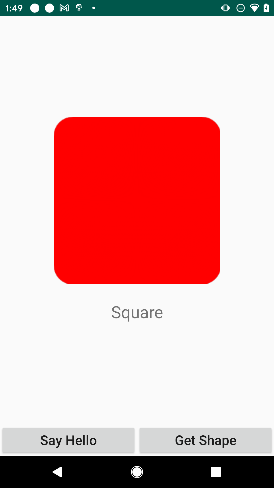
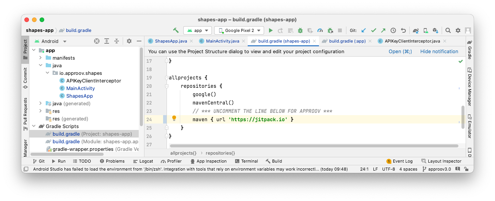
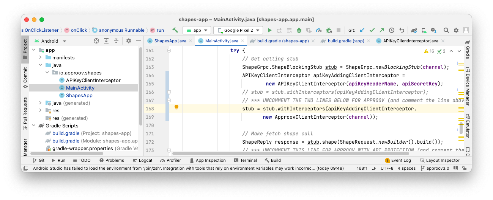

# Shapes Example

This quickstart is written specifically for native Android apps that are written in Java and use [`GRPC-Java`](https://github.com/grpc/grpc-java) for making the API calls that you wish to protect with Approov. This quickstart provides a step-by-step example of integrating Approov into an app using a simple `Shapes` example that shows a geometric shape based on a request to an API backend that can be protected with Approov.

## WHAT YOU WILL NEED
* Access to a trial or paid Approov account
* The `approov` command line tool [installed](https://approov.io/docs/latest/approov-installation/) with access to your account
* [Android Studio](https://developer.android.com/studio) installed (Android Studio Chipmunk version 2021.2.1 is used in this guide)
* The contents of this repo

## RUNNING THE SHAPES APP WITHOUT APPROOV

Open the project in the `shapes-app` folder using `File->Open` in Android Studio. Run the app as follows:


You will see two buttons:

<p>
    
</p>

Click on the `Say Hello` button and you should see this:

<p>
    
</p>

This checks the connectivity by connecting to `grpc.shapes.approov.io:443` and making a `hello` remote procedure call. Now press the `Get Shape` button and you will see this (or a different shape):

<p>
    
</p>

This contacts `grpc.shapes.approov.io:443` to get the name of a random shape. This remote procedure call is protected with an API key that is built into the code, and therefore can be easily extracted from the app.

The subsequent steps of this guide show you how to provide better protection, either using an Approov Token or by migrating the API key to become an Approov managed secret.

## ADD THE APPROOV DEPENDENCY

The Approov integration is available via [`jitpack`](https://jitpack.io). This allows inclusion into the project by simply specifying a dependency in the `gradle` files for the app. Firstly, `jitpack` needs to be added to the `repositories` section in the `build.gradle` file at the top level of the project by uncommenting line 24:

```
maven { url 'https://jitpack.io' }
```



The `approov-service-android-java-grpc` dependency needs to be added to the `app/build.gradle` file at the app level. Uncomment line 66 to do this:


Note that in this case the dependency has been added with the tag `main-SNAPSHOT`. However, for your projects we recommend you add a dependency to a specific version:

```
implementation 'com.github.approov:approov-service-android-java-grpc:3.1.0'
```

Make sure you do a Gradle sync (by selecting `Sync Now` in the banner at the top of the modified `.gradle` file) after making these changes.

Note that `approov-service-android-java-grpc` is actually an open source wrapper layer that allows you to use Approov easily with `GRPC-Java`. `approov-service-android-java-grpc` has a further dependency to the closed source [Approov SDK](https://github.com/approov/approov-android-sdk) itself.

## ENSURE THE SHAPES API IS ADDED

In order for Approov tokens to be generated for `grpc.shapes.approov.io` it is necessary to inform Approov about it:
```
approov api -add grpc.shapes.approov.io
```
Tokens for this domain will be automatically signed with the specific secret for this domain, rather than the normal one for your account.

## MODIFY THE APP TO USE APPROOV

Uncomment the `ApproovService` import and the initialization call in `io/approov/shapes/ShapesApp.java` at lines 23 and 32, respectively:


This initializes Approov when the app is first created. The Approov SDK needs a configuration string to identify the account associated with the app. It will have been provided in the Approov onboarding email (it will be something like `#123456#K/XPlLtfcwnWkzv99Wj5VmAxo4CrU267J1KlQyoz8Qo=`). Copy this into `io/approov/shapes/ShapesApp.java`, replacing the text `<enter-your-config-string-here>`.

The configuration string can also be obtained by issuing this Approov CLI command:

```
approov sdk -getConfigString
```

Next we need to use Approov when we make a request for a shape. A few lines of code need to be changed in the file `io/approov/shapes/MainActivity.java`. Uncomment the imports of `ApproovChannelBuilder`, `ApproovClientInterceptor` and `ApproovService` in lines 30-32:


Line 83 needs to be commented out and line 85 needs to be uncommented:


This creates a channel as normal, but also pins the connection to the server to ensure that no Man-in-the-Middle can eavesdrop on any communication being made.

Comment out line 166 and uncomment lines 168, 169 to add an `ApproovClientInterceptor` to the calling stub:



The interceptor automatically fetches an Approov token and adds it as a header to any GRPC request made and may also substitute header values to hold secure string secrets.

Note that this interceptor may cancel a request (with an `ApproovException` as the error) if it is unable to fetch an Approov token. If this is due to no or poor Internet connectivity then the exception is an `ApproovNetworkException`. In this case the user should be able to initiate a retry. During development a cancel may occur due to a misconfiguration, see [Approov Fetch Status](https://approov.io/docs/latest/approov-usage-documentation/#approov-fetch-status).

Finally, edit lines 172-174 of `MainActivity.java` to change to using the `approovShape` remote procedure call for which the server checks the Approov token (as well as the API key built into the app):


## ADD YOUR SIGNING CERTIFICATE TO APPROOV

In order for Approov to recognize the app as being valid, the local certificate used to sign the app needs to be added to Approov. The following assumes it is in PKCS12 format:

```
approov appsigncert -add ~/.android/debug.keystore -storePassword android -autoReg
```

This ensures that any app signed with the certificate used on your development machine will be recognized by Approov. See [Android App Signing Certificates](https://approov.io/docs/latest/approov-usage-documentation/#android-app-signing-certificates) if your keystore format is not recognized or if you have any issues adding the certificate.

> **IMPORTANT:** The addition takes up to 30 seconds to propagate across the Approov Cloud Infrastructure so don't try to run the app again before this time has elapsed.

## SHAPES APP WITH APPROOV API PROTECTION

Run the app and press the `Get Shape` button. You should now see this (or another shape):

<p>
    
</p>

This means that the app is getting a validly signed Approov token to present to the server for the `approovShape` GRPC.

> **NOTE:** Running the app on an emulator will not provide valid Approov tokens. You will need to force the device to always pass (see below).

## WHAT IF I DON'T GET SHAPES

If you still don't get a valid shape then there are some things you can try. Remember this may be because the device you are using has some characteristics that cause rejection for the currently set [Security Policy](https://approov.io/docs/latest/approov-usage-documentation/#security-policies) on your account:

* Ensure that the version of the app you are running is signed with the correct certificate.
* Look at the [`logcat`](https://developer.android.com/studio/command-line/logcat) output from the device. Information about any Approov token fetched or an error is output at the `DEBUG` level. You can easily [check](https://approov.io/docs/latest/approov-usage-documentation/#loggable-tokens) the validity and find out any reason for a failure.
* Use `approov metrics` to see [Live Metrics](https://approov.io/docs/latest/approov-usage-documentation/#live-metrics) of the cause of failure.
* You can use a debugger or emulator and get valid Approov tokens if you [mark the signing certificate as being for development](https://approov.io/docs/latest/approov-usage-documentation/#development-app-signing-certificates).

## SHAPES APP WITH SECRETS PROTECTION

This section provides an illustration of an alternative option for Approov protection if you are not able to modify the backend to add an Approov Token check. Firstly, revert any previous change to `MainActivity.java`, lines 172-174 to using the `shape` GRPC that simply checks for an API key:

```Java
// Make fetch shape call
ShapeReply response = stub.shape(request);
// *** UNCOMMENT THE LINE BELOW FOR APPROOV API PROTECTION (and comment the line above) ***
// ShapeReply response = stub.approovShape(request);
```

The `shapes_api_key` should also be changed to `shapes_api_key_placeholder` at `MainActivity.java`, lines 46-47, removing the actual API key out of the code:

```Java
// String apiSecretKey = "yXClypapWNHIifHUWmBIyPFAm";
// *** UNCOMMENT THE LINE BELOW FOR APPROOV SECRETS PROTECTION (and comment the line above) ***
String apiSecretKey = "shapes_api_key_placeholder";
```

You must inform Approov that it should map `shapes_api_key_placeholder` to `yXClypapWNHIifHUWmBIyPFAm` (the actual API key) in requests as follows:

```
approov secstrings -addKey shapes_api_key_placeholder -predefinedValue yXClypapWNHIifHUWmBIyPFAm
```

> Note that this command requires an [admin role](https://approov.io/docs/latest/approov-usage-documentation/#account-access-roles).

Next we need to set up `ApproovService` so that it substitutes the placeholder value for the real API key on the `Api-Key` header. For this, only one further line of code needs to be changed at `io/approov/shapes/MainActivity.java`, line 87:

```Java
// *** UNCOMMENT THE LINE BELOW FOR APPROOV SECRETS PROTECTION
ApproovService.addSubstitutionHeader("apiKeyHeaderName", null);
```

Build and run the app and press the `Get Shape` button. You should now see this (or another shape):

<p>
    
</p>

This means that the app is able to access the API key, even though it is no longer embedded in the app configuration, and provide it to the `shape` GRPC.
