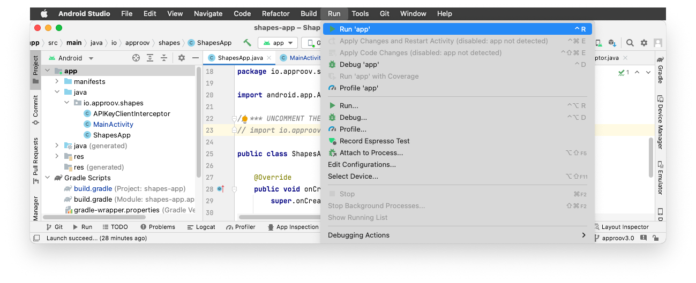
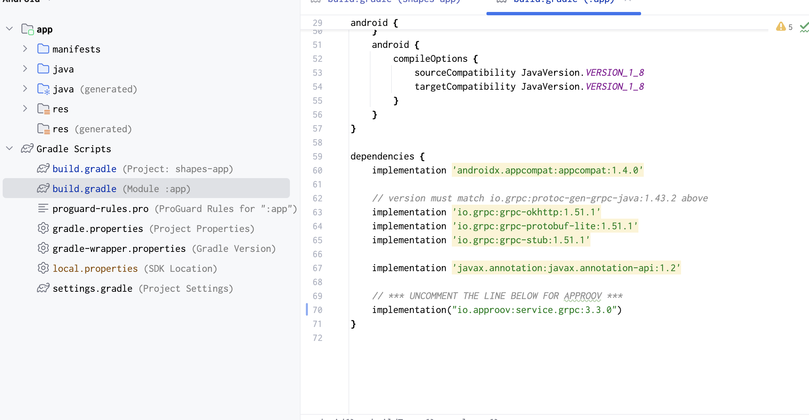
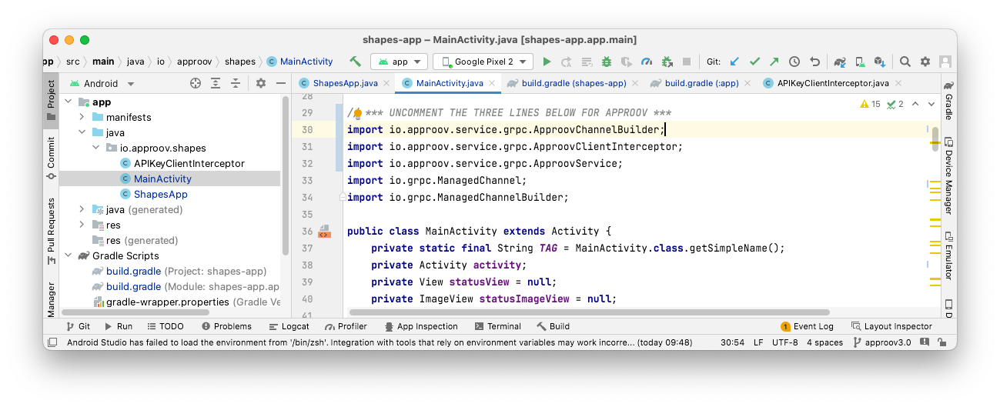

# Shapes Example

This quickstart is written specifically for native Android apps that are written in Java and use [`GRPC-Java`](https://github.com/grpc/grpc-java) for making the API calls that you wish to protect with Approov. This quickstart provides a step-by-step example of integrating Approov into an app using a simple `Shapes` example that shows a geometric shape based on a request to an API backend that can be protected with Approov.

## WHAT YOU WILL NEED
* Access to a trial or paid Approov account
* The `approov` command line tool [installed](https://approov.io/docs/latest/approov-installation/) with access to your account
* [Android Studio](https://developer.android.com/studio) installed (Arctic Fox version 2020.3.1 is used in this guide)
* The contents of this repo

## RUNNING THE SHAPES APP WITHOUT APPROOV

Open the project in the `shapes-app` folder using `File->Open` in Android Studio. Run the app as follows:



You will see two buttons:

<p>
    
</p>

Click on the `Say Hello` button and you should see this:

<p>
    
</p>

This checks the connectivity by connecting to `grpc.shapes.approov.io:50051` and making a `hello` remote procedure call. Now press the `Get Shape` button and you will see this:

<p>
    
</p>

This contacts `grpc.shapes.approov.io:50051` to get the name of a random shape. It receives the error `io.grpc.StatusRunTimeException:UNKNOWN:Approov Token Missing` because this endpoint is protected with an Approov token. Next, you will add Approov into the app so that it can generate valid Approov tokens and get shapes.

## ADD THE APPROOV DEPENDENCY

The Approov integration is available via [`jitpack`](https://jitpack.io). This allows inclusion into the project by simply specifying a dependency in the `gradle` files for the app. Firstly, `jitpack` needs to be added to the `repositories` section in the `build.gradle` file at the top level of the project by uncommenting line 23:


The `approov-service-android-java-grpc` dependency needs to be added to the `app/build.gradle` file at the app level. Uncomment line 66 to do this:



Note that in this case the dependency has been added with the tag `main-SNAPSHOT`. However, for your projects we recommend you add a dependency to a specific version:

```
implementation 'com.github.approov:approov-service-android-java-grpc:main-2.7.0'
```

Make sure you do a Gradle sync (by selecting `Sync Now` in the banner at the top of the modified `.gradle` file) after making these changes.

Note that `approov-service-android-java-grpc` is actually an open source wrapper layer that allows you to use Approov easily with `GRPC-Java`. `approov-service-android-java-grpc` has a further dependency to the closed source [Approov SDK](https://github.com/approov/approov-android-sdk) itself.

## ENSURE THE SHAPES API IS ADDED

In order for Approov tokens to be generated for `grpc.shapes.approov.io` it is necessary to inform Approov about it:
```
approov api -add grpc.shapes.approov.io
```
Tokens for this domain will be automatically signed with the specific secret for this domain, rather than the normal one for your account.

## MODIFY THE APP TO USE APPROOV

Uncomment the `ApproovService` import and the initialization call in `io/approov/shapes/ShapesApp.java` at lines 24 and 33, respectively:


This initializes Approov when the app is first created. It requires a configuration string which we will set in the next step. All calls to `ApproovService` and the SDK itself are thread safe.

The Approov SDK needs a configuration string to identify the account associated with the app. It will have been provided in the Approov onboarding email (it will be something like `#123456#K/XPlLtfcwnWkzv99Wj5VmAxo4CrU267J1KlQyoz8Qo=`). Copy this into `io/approov/shapes/ShapesApp.java:33`, replacing the text `<enter-your-config-string-here>`.

The configuration string can also be obtained by issuing this Approov CLI command:

```
approov sdk -getConfigString
```

Next we need to use Approov when we make a request for a shape. A few lines of code need to be changed in the file `io/approov/shapes/MainActivity.java`. Uncomment the imports of `ApproovChannelBuilder` and `ApproovClientInterceptor` in lines 31 and 32:



Line 77 needs to be commented out and line 79 needs to be uncommented:


This creates a channel as normal, but also pins the connection to the endpoint to ensure that no Man-in-the-Middle can eavesdrop on any communication being made.

Line 157 needs to be uncommented:


We add an `ApproovClientInterceptor` to the calling stub. The interceptor automatically fetches an Approov token and adds it as a header to any GRPC request made.

Note that this interceptor may cancel a request if it is unable to fetch an Approov token, typically due to no or poor Internet connectivity. If this happens, then the user should be able to initiate a retry. During development a cancel may occur due to a misconfiguration, see [Token Fetch Errors](https://approov.io/docs/latest/approov-usage-documentation/#token-fetch-errors).

Run the app again to ensure that the `app-debug.apk` in the generated build outputs is up to date.

## REGISTER YOUR APP WITH APPROOV

In order for Approov to recognize the app as being valid it needs to be registered with the service. Change directory to the top level of the `shapes-app` project and then register the app with Approov:

```
approov registration -add app/build/outputs/apk/debug/app-debug.apk
```
Note, on Windows you need to substitute \ for / in the above command.

> **IMPORTANT:** The registration takes up to 30 seconds to propagate across the Approov Cloud Infrastructure, therefore don't try to run the app again before this time as elapsed. During development of your app you can ensure it [always passes](https://approov.io/docs/latest/approov-usage-documentation/#adding-a-device-security-policy) so you do not have to register the APK each time you modify it.

## RUNNING THE SHAPES APP WITH APPROOV

Run the app again without making any changes to the app and press the `Get Shape` button. You should now see this (or another shape):

<p>
    
</p>

This means that the app is getting a validly signed Approov token to present to the shapes endpoint.

> **NOTE:** Running the app on an emulator will not provide valid Approov tokens. You will need to force the device to always pass (see below).

## WHAT IF I DON'T GET SHAPES

If you still don't get a valid shape then there are some things you can try. Remember this may be because the device you are using has some characteristics that cause rejection for the currently set [Security Policy](https://approov.io/docs/latest/approov-usage-documentation/#security-policies) on your account:

* Ensure that the version of the app you are running is exactly the one you registered with Approov. Also, if you are running the app from a debugger then valid tokens are not issued.
* Look at the [`logcat`](https://developer.android.com/studio/command-line/logcat) output from the device. Information about any Approov token fetched or an error is output at the `INFO` level, e.g. `2021-12-17 10:10:43.622 7765-7877/io.approov.shapes I/ApproovService: Approov Token for grpc.shapes.approov.io: {"exp":1639736153,"ip":"82.3.126.133","did":"6w/hSQf37wNRrk+tWoRKQA==","arc":"COEQ3ZUCQK","sip":"MAwuBF"}`. You can easily [check](https://approov.io/docs/latest/approov-usage-documentation/#loggable-tokens) the validity and find out any reason for a failure.
* Consider using an [Annotation Policy](https://approov.io/docs/latest/approov-usage-documentation/#annotation-policies) during initial development to directly see why the device is not being issued with a valid token.
* Use `approov metrics` to see [Live Metrics](https://approov.io/docs/latest/approov-usage-documentation/#live-metrics) of the cause of failure.
* You can use a debugger or emulator and get valid Approov tokens on a specific device by ensuring it [always passes](https://approov.io/docs/latest/approov-usage-documentation/#adding-a-device-security-policy). As a shortcut, when you are first setting up, you can add a [device security policy](https://approov.io/docs/latest/approov-usage-documentation/#adding-a-device-security-policy) using the `latest` shortcut as discussed so that the `device ID` doesn't need to be extracted from the logs or an Approov token.
